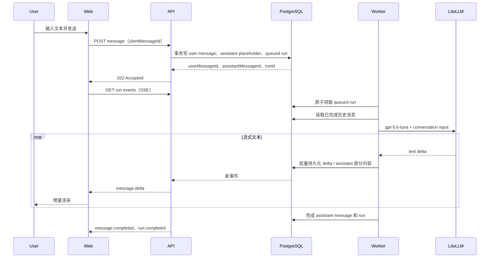

# Conversations and Agent Runs Phase 1 对话 Agent 技术方案

Status: Current
Last verified: 2026-08-26
Read when: 修改消息持久化、Agent Run、Worker 执行、Agent Event 或 SSE
Applies to: API、Worker、Contracts 和数据库中的持久化对话链路

## Related

- Business: `docs/business/conversations-and-agent-runs.md`
- Technical: `docs/technical/openai-agents-litellm.md`
- Architecture: `ARCHITECTURE.md`

## Purpose

> 文档定位：持久化对话 Phase 1 的技术设计与验收依据。当前业务能力、状态不变量和未支持项以 [`../business/conversations-and-agent-runs.md`](../business/conversations-and-agent-runs.md) 为准。

## 1. 目标

Phase 1 先交付一个能与用户连续对话的主 Agent，验证以下最小闭环：

1. Web 能加载历史消息并发送新消息。
2. 用户消息可靠写入 PostgreSQL。
3. Worker 使用固定 LiteLLM 别名 `gpt-5.6-luna` 生成回复。
4. 回复通过 SSE 流式展示，并在完成后可靠写入 PostgreSQL。
5. 页面刷新或 SSE 断线后，可从数据库恢复一致的会话状态。

本阶段不实现 Coding Agent、文件操作、Sandbox、Tools、Handoff、子 Agent、审批、附件、语音、联网搜索和自动执行任务。Agent 只能基于系统指令和当前会话历史输出文本。

## 2. 关键决策

| 主题     | Phase 1 决策                                                    |
| -------- | --------------------------------------------------------------- |
| Agent    | 只注册一个 `main-chat` 主 Agent                                 |
| 模型     | 固定使用 LiteLLM Alias `gpt-5.6-luna`，大小写和标点必须完全一致 |
| 模型通道 | 延续现有 OpenAI Agents SDK + LiteLLM Chat Completions 通道      |
| 多轮记忆 | Wex PostgreSQL 是唯一事实来源，由服务端组装历史上下文           |
| 实时协议 | REST 负责命令与查询，SSE 负责服务端单向事件流                   |
| 持久化   | 保存 Conversation、Message、AgentRun 和 AgentEvent              |
| 并发     | 同一 Conversation 同时只允许一个活跃 Run                        |
| 内容类型 | Phase 1 只允许文本，数据库使用可演进的版本化 JSON 内容格式      |
| 模型降级 | 不静默切换到其他模型；失败时明确结束本次 Run                    |

模型请求必须使用 Alias `gpt-5.6-luna`，不要在业务代码中写其 Target Model Group，也不要继续使用现有的 `coding-fast`、`fast` 等逻辑名称。LiteLLM 负责把 Alias 路由到实际部署。

## 3. 当前仓库差距

仓库已经具备以下基础：

- `apps/worker` 已接入 `@openai/agents`，并能从 SDK 流中映射 `message.delta`、`usage.updated` 和完成事件。
- `packages/model` 已封装 LiteLLM Provider、模型目录与请求超时。
- `apps/web` 已有项目内聊天面板，但目前只展示一轮模拟消息。
- `apps/api` 已通过服务端 Supabase Client 读写 PostgreSQL。
- `packages/contracts` 已有 AgentRun 与 AgentEvent 的初始共享类型。

尚缺少：

- Conversation、Message、AgentRun、AgentEvent 数据表。
- 聊天 REST API、SSE API 与 API 到 Worker 的持久化派发机制。
- 多轮历史组装和 token 预算控制。
- 前端真实消息列表、流式状态、断线恢复和错误状态。
- `message.delta` 与具体 assistant message 的稳定关联。

现有 `CodingAgent`、`maxTurns: 80` 和单字符串 `prompt` 入口不适合作为本阶段最终契约，需要收敛为无工具的 `main-chat` Agent，并允许 Runtime 接收结构化历史输入。

## 4. 目标架构

```text
React ChatPanel
  |-- REST: 创建/查询会话、加载/发送消息
  |-- SSE: 订阅单次 Run 的流式事件
  v
NestJS API
  |-- ConversationService / MessageService
  |-- AgentRunService / SSE Event Stream
  v
Supabase PostgreSQL（唯一事实来源 + Phase 1 持久化队列）
  ^
  |-- Worker 领取 queued Run
  |-- 读取消息历史并调用 AgentRuntime
  |-- 批量写 assistant 内容和 AgentEvent
  v
OpenAI Agents SDK -> LiteLLM -> `gpt-5.6-luna`
```

API 不直接等待模型返回。发送消息接口只完成数据库事务并返回 `202 Accepted`；Worker 独立处理 Run。浏览器断开不会取消模型运行，重新订阅时 API 从 `agent_events` 补发遗漏事件。

Phase 1 可使用 PostgreSQL `agent_runs.status = 'queued'` 作为持久化队列，并通过数据库函数以 `FOR UPDATE SKIP LOCKED` 原子领取任务。这样不必立即引入 Redis。吞吐量明显增长后，再将派发实现替换为 BullMQ 或其他队列，HTTP 与数据库契约保持不变。

## 5. 核心对话流

### 5.1 打开项目

1. Web 请求项目的会话列表；Phase 1 没有会话时自动创建一个默认会话。
2. Web 请求该会话的历史消息，按 `position` 升序渲染。
3. 若返回存在 `queued` 或 `running` Run，Web 订阅该 Run 的 SSE，而不是再次发起模型请求。
4. `streaming` assistant message 使用数据库已保存的部分内容作为初始值，后续 delta 继续追加。

### 5.2 发送消息



发送接口必须在一个数据库事务中完成：

1. 校验 Conversation 属于当前 Project/用户。
2. 根据 `clientMessageId` 做幂等检查。
3. 检查该 Conversation 没有活跃 Run。
4. 创建 `completed` user message。
5. 创建空的 `streaming` assistant message。
6. 创建引用这两条消息的 `queued` AgentRun。

任何一步失败都整体回滚，不能出现“用户消息已经展示但永远没有对应 Run”的半完成状态。

### 5.3 Worker 生成回复

1. Worker 原子领取 Run，将状态改为 `running` 并记录 `started_at`。
2. 按 `position` 读取该 Conversation 中 `completed` 的 user/assistant 消息，包含本次 user message，不包含当前 assistant placeholder。
3. 将数据库 Message 映射为 SDK 可接受的会话输入，并调用 `AgentRuntime.run()`。
4. 将 SDK 文本 delta 聚合后写入 `agent_events`，并周期性更新 assistant message 的部分内容。
5. SDK 完成后，在一个事务中写最终 assistant 内容、usage 和 Run 状态。
6. SDK 失败或超时后，将 assistant message 和 Run 标为 `failed`，写入稳定错误码。

无 Tools 时一次 Run 只需要一次模型生成，`maxTurns` 设为 `1`。这既表达产品边界，也避免异常模型输出触发没有意义的 Agent 循环。

## 6. API 契约

所有示例省略已有的 `/api` 全局前缀。

### 6.1 Conversation

```http
GET /projects/:projectId/conversations
POST /projects/:projectId/conversations
GET /conversations/:conversationId
```

创建请求：

```json
{
  "title": "新对话"
}
```

Phase 1 可限制一个 Project 只有一个默认 Conversation，但数据模型保持一对多，避免后续支持“新建对话”时迁移 Message 归属。

### 6.2 加载消息

```http
GET /conversations/:conversationId/messages?before=<position>&limit=50
```

响应按 `position` 升序返回；`before` 用于向上翻页。首屏返回最新 50 条，服务端最大 `limit` 为 100。

```json
{
  "items": [
    {
      "id": "uuid",
      "conversationId": "uuid",
      "runId": null,
      "role": "user",
      "status": "completed",
      "content": {
        "schemaVersion": 1,
        "parts": [{ "type": "text", "text": "你好" }]
      },
      "position": 101,
      "createdAt": "2026-08-16T10:00:00.000Z",
      "completedAt": "2026-08-16T10:00:00.000Z"
    }
  ],
  "nextBefore": 101,
  "activeRun": null
}
```

### 6.3 发送消息

```http
POST /conversations/:conversationId/messages
Content-Type: application/json
Idempotency-Key: <clientMessageId>
```

```json
{
  "clientMessageId": "客户端生成的 UUID",
  "content": {
    "schemaVersion": 1,
    "parts": [{ "type": "text", "text": "请解释一下这个概念" }]
  }
}
```

成功返回 `202 Accepted`：

```json
{
  "userMessage": { "id": "uuid", "status": "completed" },
  "assistantMessage": { "id": "uuid", "status": "streaming" },
  "run": { "id": "uuid", "status": "queued" },
  "eventsUrl": "/api/agent-runs/uuid/events"
}
```

校验规则：

- `clientMessageId` 必须是 UUID，同一 Conversation 内唯一。
- Phase 1 `parts` 必须恰好包含一个非空 `text` part。
- 去除首尾空格后长度为 1 到 20,000 个 Unicode 字符。
- Conversation 已有活跃 Run 时返回 `409 CONVERSATION_BUSY`。
- 相同 `clientMessageId` 重试时返回第一次创建的相同资源，不创建重复消息。

### 6.4 订阅事件

```http
GET /agent-runs/:runId/events
Accept: text/event-stream
Last-Event-ID: 17
```

SSE 示例：

```text
id: 18
event: message.delta
data: {"id":"event-uuid","runId":"run-uuid","sequence":18,"type":"message.delta","createdAt":"...","payload":{"messageId":"assistant-uuid","delta":"你好"}}

```

事件类型：

| 类型                | Payload                        | 前端行为                            |
| ------------------- | ------------------------------ | ----------------------------------- |
| `run.started`       | `attemptId`, `model`           | 将发送状态切为生成中                |
| `message.delta`     | `messageId`, `delta`           | 追加到指定 assistant message        |
| `usage.updated`     | `inputTokens`, `outputTokens`  | 不必展示，供观测使用                |
| `message.completed` | `messageId`, `content`         | 用完整内容覆盖本地 buffer，消除漏包 |
| `run.completed`     | `{}`                           | 关闭流并解除输入锁定                |
| `run.failed`        | `code`, `retryable`, `message` | 展示可重试错误并关闭流              |
| `run.cancelled`     | `{}`                           | 标记回复已停止并关闭流              |

规则：

- `sequence` 在单个 Run 内从 1 严格递增，数据库唯一约束为 `(run_id, sequence)`。
- API 先回放 `sequence > Last-Event-ID` 的持久化事件，再等待新事件。
- 每 15 秒发送 SSE comment 心跳；心跳不写数据库。
- `run.completed`、`run.failed`、`run.cancelled` 是终止事件，发送后 API 主动关闭连接。
- Phase 1 API 可以每 200ms 查询一次新事件；后续可换成 PostgreSQL `NOTIFY`，对外契约不变。
- Worker 必须先持久化事件，再允许 API 推送。SSE 不是事实来源。

浏览器与 API 同源且使用 Cookie 鉴权时可使用原生 `EventSource`。如果未来改用 Bearer Token，优先使用 `fetch()` 读取 SSE 流，因为原生 `EventSource` 不能可靠设置自定义 Authorization Header。

### 6.5 取消

```http
POST /agent-runs/:runId/cancel
```

Phase 1 可作为紧随聊天闭环之后的增强项。取消请求只把数据库 Run 标记为 `cancelling`；Worker 观察到状态后触发现有 `RunCancellationRegistry`。重复取消必须幂等。

## 7. 数据库存储设计

### 7.1 `conversations`

| 字段              | 类型               | 说明                                          |
| ----------------- | ------------------ | --------------------------------------------- |
| `id`              | `uuid`             | 主键                                          |
| `project_id`      | `uuid`             | 外键到 `projects.id`，删除 Project 时级联删除 |
| `owner_id`        | `uuid null`        | 预留用户隔离；接入 Auth 后必须非空            |
| `title`           | `text`             | 默认“新对话”，长度 1-100                      |
| `status`          | `text`             | `active` / `archived`                         |
| `last_message_at` | `timestamptz null` | 会话排序                                      |
| `created_at`      | `timestamptz`      | 创建时间                                      |
| `updated_at`      | `timestamptz`      | 更新时间                                      |

索引：`(project_id, last_message_at desc)`。

### 7.2 `messages`

| 字段                | 类型                                  | 说明                                               |
| ------------------- | ------------------------------------- | -------------------------------------------------- |
| `id`                | `uuid`                                | 主键                                               |
| `conversation_id`   | `uuid`                                | 会话外键                                           |
| `run_id`            | `uuid null`                           | assistant message 对应 Run；user message 可为空    |
| `client_message_id` | `uuid null`                           | 用户消息幂等键                                     |
| `role`              | `text`                                | Phase 1 只允许 `user` / `assistant`                |
| `status`            | `text`                                | `streaming` / `completed` / `failed` / `cancelled` |
| `content`           | `jsonb`                               | 版本化内容，格式见下文                             |
| `position`          | `bigint generated always as identity` | 稳定排序游标                                       |
| `error`             | `jsonb null`                          | 稳定错误码和安全的用户可见信息                     |
| `created_at`        | `timestamptz`                         | 创建时间                                           |
| `completed_at`      | `timestamptz null`                    | 完成时间                                           |

约束和索引：

- `(conversation_id, position)` 唯一。
- `(conversation_id, client_message_id)` 在 `client_message_id is not null` 时唯一。
- `run_id` 在非空时唯一，保证一次 Run 只有一个 assistant message。
- `(conversation_id, position desc)` 用于历史分页。

不要把 system prompt 存成普通 Message。system instructions 属于 Agent 配置，Run 通过 `agent_version` 保存快照引用，否则更新提示词后会污染用户可见的聊天历史。

### 7.3 Message 内容格式

数据库中的规范格式：

```ts
type MessageContentV1 = {
  schemaVersion: 1;
  parts: Array<{
    type: "text";
    text: string;
  }>;
};
```

Phase 1 虽然只有文本，仍使用 `parts`，便于未来增加 `image`、`file`、`artifact_ref` 等类型。所有新增 part 类型必须升级共享契约并保持旧版本可读，不能直接把供应商或 Agents SDK 的原始对象写入业务表。

`content` 是唯一规范内容，避免同时维护 `content_text` 与 JSON 两份可漂移数据。若后续需要全文搜索，再增加由数据库生成的搜索列或独立索引。

流式生成期间不要每个 token 更新一次 JSONB。Worker 在内存中累积文本，并在以下任一条件满足时批量 flush：

- 距离上次 flush 达到 250ms；
- 累积达到 100 个字符；
- 收到终止事件。

每次 flush 在同一事务中更新 assistant `content` 并插入一个聚合后的 `message.delta` 事件。这样在可恢复性和数据库写放大之间取得平衡。

### 7.4 `agent_runs`

| 字段                   | 类型               | 说明                                                                       |
| ---------------------- | ------------------ | -------------------------------------------------------------------------- |
| `id`                   | `uuid`             | 主键                                                                       |
| `conversation_id`      | `uuid`             | 会话外键                                                                   |
| `user_message_id`      | `uuid`             | 触发本次生成的用户消息，唯一                                               |
| `assistant_message_id` | `uuid`             | 本次输出占位消息，唯一                                                     |
| `status`               | `text`             | `queued` / `running` / `cancelling` / `completed` / `failed` / `cancelled` |
| `agent_id`             | `text`             | 固定 `main-chat`                                                           |
| `agent_version`        | `text`             | system instructions 版本                                                   |
| `model_alias`          | `text`             | 固定快照 `gpt-5.6-luna`                                                    |
| `model_config_version` | `text`             | 模型配置版本                                                               |
| `attempt_id`           | `uuid`             | Worker 执行尝试 ID                                                         |
| `input_tokens`         | `integer null`     | 输入 token                                                                 |
| `output_tokens`        | `integer null`     | 输出 token                                                                 |
| `error_code`           | `text null`        | 稳定错误码                                                                 |
| `error_message`        | `text null`        | 脱敏后的错误信息                                                           |
| `created_at`           | `timestamptz`      | 排队时间                                                                   |
| `started_at`           | `timestamptz null` | 开始时间                                                                   |
| `completed_at`         | `timestamptz null` | 终止时间                                                                   |

对 `queued`、`running`、`cancelling` 建立 Conversation 级部分唯一索引，数据库层保证同一会话最多一个活跃 Run。

### 7.5 `agent_events`

| 字段         | 类型          | 说明                                  |
| ------------ | ------------- | ------------------------------------- |
| `id`         | `uuid`        | 事件 ID                               |
| `run_id`     | `uuid`        | Run 外键                              |
| `sequence`   | `integer`     | Run 内单调序号                        |
| `type`       | `text`        | 稳定的 Wex 事件类型                   |
| `payload`    | `jsonb`       | Wex 契约 payload，不保存 SDK 原始事件 |
| `created_at` | `timestamptz` | 创建时间                              |

约束为 `(run_id, sequence)` 唯一，索引同样使用 `(run_id, sequence)`。高频 SDK 原始事件只进入结构化日志或 Trace，不直接进入业务数据库。

## 8. 上下文组装

PostgreSQL 是会话历史唯一事实来源。本阶段不使用 LiteLLM 或供应商侧的 `conversationId` / `previousResponseId`，也不同时启用 SDK Session 自动持久化，避免出现两套历史状态。

每次 Run 的输入按以下规则构建：

1. system instructions 从 `main-chat` Agent 配置读取。
2. 从当前 Conversation 读取 `completed` 的 user/assistant messages。
3. 按 `position` 升序排列，保证 user/assistant 轮次顺序。
4. 排除 `failed`、`cancelled` 和当前 `streaming` assistant placeholder。
5. 从最新消息向前选取不超过输入预算的完整轮次，再恢复为正序。
6. 当前 user message 必须始终保留；单条消息本身超限时返回稳定错误，不静默截断用户原文。

建议首版给历史上下文设置独立 token 预算，而不是依赖模型最大窗口。例如配置 `maxInputTokens`，并为 system instructions 与输出预留空间。准确 token 计数暂不可用时可以先采用保守字符估算，但必须记录 `context_message_count` 和实际 `input_tokens`，用于后续校准。

Phase 1 不做自动摘要，因为摘要会引入第二次模型调用、摘要一致性与可追溯性问题。达到上下文上限时先丢弃最旧的完整轮次；后续再单独设计摘要 Message 或 checkpoint。

## 9. 主 Agent 配置

建议新增 `main-chat-agent.config.ts`：

```ts
export const MAIN_CHAT_AGENT_CONFIG = {
  id: "main-chat",
  name: "Wex",
  version: "2026-08-16.1",
  modelRole: "chat",
  maxTurns: 1,
  instructions: [
    "你是 Wex，一个与用户对话的 AI 助手。",
    "直接、准确地回答用户，并延续当前会话上下文。",
    "当前没有任何工具、文件系统或外部访问能力。",
    "不要声称已经搜索、执行命令、修改文件或完成现实世界操作。",
    "不确定时明确说明不确定，不编造事实或执行结果。",
  ],
} as const;
```

`packages/model` 增加 `chat` 模型角色，并将其唯一配置为：

```ts
aliases: {
  chat: "gpt-5.6-luna",
}
```

Runtime 的 `run.started.payload.model.alias`、`agent_runs.model_alias` 和 Trace metadata 必须都记录最终值 `gpt-5.6-luna`，以便确认没有发生命名偏差。

提示词只定义稳定身份和能力边界。回复风格、长度等调优应通过版本化评测迭代，不要在第一版加入大量互相冲突的规则。

## 10. 前端状态模型

`ChatPanel` 不再使用 `submittedPrompt` 和定时器模拟状态，改为以下状态：

```ts
type ChatState = {
  conversationId: string | null;
  messages: ChatMessage[];
  activeRunId: string | null;
  connection: "idle" | "connecting" | "streaming" | "reconnecting";
  sending: boolean;
  error: ChatError | null;
};
```

交互规则：

- 用户点击发送后立即以 `clientMessageId` 乐观插入 user message。
- `202` 返回后，用服务端 ID 对齐乐观消息并插入 assistant placeholder。
- `message.delta` 必须按 `messageId` 更新，不能假设“最后一条消息”就是目标。
- `message.completed` 用服务端完整内容覆盖本地内容，处理重复 delta 或断线漏包。
- 发送中清空输入框，但保留原文快照；请求失败时恢复输入或提供一键重试。
- 活跃 Run 期间禁用再次发送，避免产生对话分支。
- SSE 意外断开时保留已渲染内容并重连；不要创建新 Run。
- 页面刷新后以 `GET messages` 的数据库内容为准，再恢复 active Run 订阅。

Phase 1 UI 至少覆盖：空会话、历史加载、发送中、排队中、流式生成、重连、完成、失败和再次发送。

## 11. 错误与一致性

建议稳定错误码：

| Code                 | 含义                  | 是否可重试       |
| -------------------- | --------------------- | ---------------- |
| `CONVERSATION_BUSY`  | 会话已有活跃 Run      | 否，等待当前 Run |
| `MESSAGE_TOO_LONG`   | 单条输入超过限制      | 否               |
| `MODEL_TIMEOUT`      | LiteLLM 请求超时      | 是               |
| `MODEL_RATE_LIMITED` | 网关或模型限流        | 是               |
| `MODEL_UNAVAILABLE`  | `gpt-5.6-luna` 不可用 | 是               |
| `MODEL_BAD_RESPONSE` | 模型响应无法解析      | 视情况           |
| `RUN_STALLED`        | Worker 超时未完成     | 是               |
| `INTERNAL_ERROR`     | 未分类服务端错误      | 是               |

一致性规则：

- 任何失败都不能把内部 LiteLLM URL、API Key、SQL、堆栈或供应商原始响应暴露给 Web。
- 如果已经产生部分回复后失败，保留部分 `content` 供排障，但消息状态必须为 `failed`，不能伪装成完成。
- 不自动切换截图中的其他模型，因为这会改变质量、成本和行为且难以追踪。
- Worker 崩溃后，由定时任务将超过 lease 的 `running` Run 重新入队；同一 `attempt_id` 不得重复写终止事件。
- 所有状态迁移使用条件更新，例如只允许 `queued -> running`，避免并发 Worker 重复领取。

## 12. 安全与数据边界

- Web 只访问 NestJS API，不直接持有 Supabase secret key 或 LiteLLM key。
- API 和 Worker 必须校验 Project、Conversation、Message、Run 的所有权关系。
- 当前 `owner_id = null` 仅适合本地单用户 MVP；上线前必须接入 Auth 并收紧 RLS/API 鉴权。
- 日志默认不记录完整用户消息和模型回复；使用 ID、长度、token 和错误码诊断。
- OpenAI Trace 保持 `traceIncludeSensitiveData: false`。
- Message 删除、导出和数据保留策略不在本阶段实现，但外键关系必须支持按 Project 级联清理。

## 13. 可观测性

每个 Run 至少记录：

- `runId`、`attemptId`、`projectId`、`conversationId`。
- `agentId = main-chat`、`agentVersion`。
- `modelAlias = gpt-5.6-luna`、`modelConfigVersion`。
- 排队时长、首 token 延迟、总耗时。
- 输入/输出 token、上下文消息数。
- 终止状态、稳定错误码、SSE 重连次数。

核心指标：Run 成功率、P50/P95 首 token 延迟、P50/P95 总耗时、每 Run token、模型超时率、SSE 重连率和 stalled Run 数量。

## 14. 实施顺序

### 阶段 A：契约与数据库

1. 在 `packages/contracts` 增加 Conversation、Message、发送响应和分页契约。
2. 给 `MessageDeltaPayload` 增加 `messageId`。
3. 新增 Conversation、Message、AgentRun、AgentEvent migration 和数据库类型。
4. 实现原子“发送消息”事务和 Worker 领取 Run 的数据库函数。

### 阶段 B：主 Agent Runtime

1. 新增 `main-chat` Agent，固定 `maxTurns: 1` 且不注册 tools。
2. 增加 `chat -> gpt-5.6-luna` 模型映射。
3. 将 Runtime 输入从单一 `prompt` 扩展为结构化 conversation items。
4. 实现历史预算、事件批量持久化和完成/失败事务。
5. 为模型别名、历史顺序、失败状态和幂等写入补单元/集成测试。

### 阶段 C：API 与 SSE

1. 新增 ConversationsModule、MessagesModule 和 AgentRunsModule。
2. 实现 Conversation 查询、消息分页、发送消息和 Run 状态接口。
3. 实现支持 `Last-Event-ID`、心跳、回放和终止关闭的 SSE。

### 阶段 D：Web

1. 将模拟 ChatPanel 改成真实消息列表和输入状态机。
2. 接入历史分页、乐观 user message、assistant placeholder 和 SSE delta。
3. 实现断线重连、刷新恢复、错误展示和重试输入。
4. 补充端到端测试：连续两轮对话、刷新恢复、断线续传、重复发送幂等、模型失败。

## 15. 验收标准

- 新项目进入聊天页后可以创建或取得一个 Conversation。
- 用户连续发送至少三轮消息，`gpt-5.6-luna` 能收到正确顺序的历史并延续上下文。
- Web 能逐步展示 assistant 文本，而不是等待完整响应。
- 刷新页面后 user/assistant 消息内容、顺序和状态与刷新前一致。
- SSE 中断后使用 `Last-Event-ID` 重连，不重复或丢失最终内容。
- 快速重复点击和网络重试不会创建重复 user message 或 Run。
- 同一 Conversation 的第二个并发发送返回 `409`。
- `agent_runs.model_alias` 与 `run.started` 均为精确字符串 `gpt-5.6-luna`。
- Agent 不调用任何 Tool，也不声称执行了文件或外部操作。
- 模型超时或不可用时，Run 和 assistant message 都进入可解释的终态。

## 16. LiteLLM 已加载模型清单

以下清单仅记录截图中的现状。业务请求使用左侧 Alias Name，不直接使用右侧 Target Model Group。

| Alias Name               | Target Model Group                                 |
| ------------------------ | -------------------------------------------------- |
| `gpt-5.4`                | `openai/gpt-5.4`                                   |
| `kimi-k3`                | `kimi-k3`                                          |
| `grok-4.5`               | `grok-4.5`                                         |
| `MiniMax-M3`             | `MiniMax-M3`                                       |
| `gpt-5.6-sol`            | `gpt-5.6-sol`                                      |
| **`gpt-5.6-luna`**       | **`gpt-5.6-luna`**                                 |
| `claude-opus-5`          | `global.anthropic.claude-opus-5`                   |
| `gpt-5.6-terra`          | `gpt-5.6-terra`                                    |
| `claude-sonnet-5`        | `global.anthropic.claude-sonnet-5`                 |
| `claude-haiku-4-5`       | `global.anthropic.claude-haiku-4-5-20251001-v1:0`  |
| `gemini-3.6-flash`       | `gemini-3.6-flash`                                 |
| `gemini-3.7-flash`       | `gemini-3.7-flash`                                 |
| `claude-sonnet-4-5`      | `global.anthropic.claude-sonnet-4-5-20250929-v1:0` |
| `claude-sonnet-4-6`      | `global.anthropic.claude-sonnet-4-6`               |
| `deepseek-v4-flash`      | `openai/deepseek-v4-flash`                         |
| `gemini-3-pro-preview`   | `gemini-3-pro-preview`                             |
| `gemini-3.1-flash-lite`  | `gemini-3.1-flash-lite`                            |
| `gemini-3.5-flash-lite`  | `gemini-3.5-flash-lite`                            |
| `gemini-3-flash-preview` | `gemini-3-flash-preview`                           |
| `gemini-3.1-pro-preview` | `gemini-3.1-pro-preview`                           |

## 17. 参考

- 现有仓库方案：`docs/technical/openai-agents-litellm.md`
- 现有总体技术栈与边界：`ARCHITECTURE.md`；阶段路线参考：`docs/technical/architecture-roadmap.md`
- OpenAI Agents SDK 的运行、流式与状态管理边界：[Running agents](https://developers.openai.com/api/docs/guides/agents/running-agents)

本方案选择由 Wex 数据库管理 Conversation 历史，而不是使用供应商侧会话状态。官方文档列出了多种状态管理方式；工程上应只选择一种事实来源，避免重复拼接或历史分叉。
